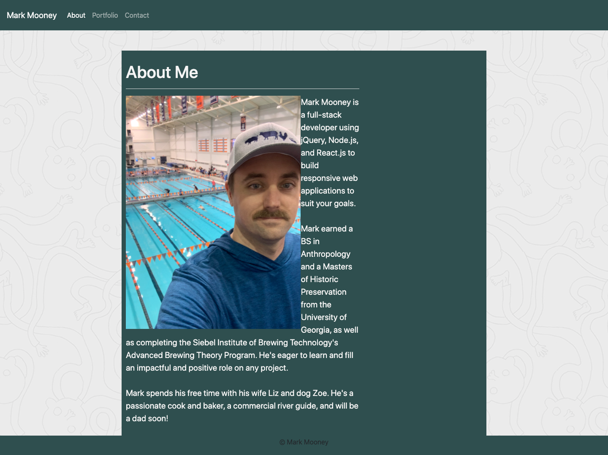

# Bootstrap Portfolio

## Badges

## Description 

This portfolio website is built using React and REact-Bootstrap for a responsive user interface across multiple device formats.

## Table of Contents

* [Usage](#usage)
* [Credits](#credits)
* [License](#license)
* [Contact](#contact)

## Installation

Clone the repo from GitHub and run index.html in your browser.

[The homepage can be directly accessed here.](https://mjmoon15.github.io/gt-bootstrap-portfolio/)

[The GitHub Repo can be accessed here.](https://github.com/mjmoon15/gt-bootstrap-portfolio)

## Usage 

These html files use Bootstrap for a responsive user experience. 

 

## Credits

Group study session with the May 2020 GT-ATL cohort helped create the look of this website.

## License

MIT License

Copyright (c) [2020] [Mark J Mooney]

Permission is hereby granted, free of charge, to any person obtaining a copy
of this software and associated documentation files (the "Software"), to deal
in the Software without restriction, including without limitation the rights
to use, copy, modify, merge, publish, distribute, sublicense, and/or sell
copies of the Software, and to permit persons to whom the Software is
furnished to do so, subject to the following conditions:

The above copyright notice and this permission notice shall be included in all
copies or substantial portions of the Software.

THE SOFTWARE IS PROVIDED "AS IS", WITHOUT WARRANTY OF ANY KIND, EXPRESS OR
IMPLIED, INCLUDING BUT NOT LIMITED TO THE WARRANTIES OF MERCHANTABILITY,
FITNESS FOR A PARTICULAR PURPOSE AND NONINFRINGEMENT. IN NO EVENT SHALL THE
AUTHORS OR COPYRIGHT HOLDERS BE LIABLE FOR ANY CLAIM, DAMAGES OR OTHER
LIABILITY, WHETHER IN AN ACTION OF CONTRACT, TORT OR OTHERWISE, ARISING FROM,
OUT OF OR IN CONNECTION WITH THE SOFTWARE OR THE USE OR OTHER DEALINGS IN THE
SOFTWARE.

  ## Contact

  [Please check out my github portfolio here.](https://github.com/mjmoon15)
  

  [For further questions, please contact me at mjmoon15@gmail.com.](mailto:mjmoon15@gmail.com) 
  

---
© 2019 Trilogy Education Services, a 2U, Inc. brand. All Rights Reserved.

